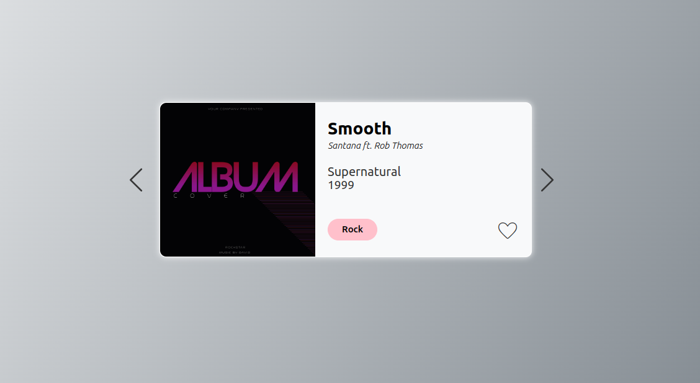

# Album-React

 <!-- Actualiza con la imagen adecuada -->

Este proyecto, llamado "Album-React", tiene como finalidad proporcionar una introducción a React y familiarizarse con la manipulación de objetos y arrays utilizando esta biblioteca. En este proyecto, se aplican los principios de HTML semántico, la metodología BEM y se utiliza Sass como pre-procesador de estilos.

## Características principales

- Manipulación de objetos y arrays con React.
- Uso de HTML semántico para estructurar el contenido.
- Implementación de la metodología BEM para organizar los estilos.
- Utilización de Sass como pre-procesador de estilos.

## Instalación

1. Clona este repositorio en tu máquina local.
2. Navega hasta el directorio raíz del proyecto.
3. Ejecuta el siguiente comando para instalar las dependencias:
- npm install
 
4.Una vez finalizada la instalación, puedes ejecutar el proyecto con el siguiente comando:

- npm start

Esto iniciará la aplicación en el navegador.

## Contribuyendo 🖇️

Si deseas contribuir a este proyecto, sigue los siguientes pasos:

1. Realiza un fork del repositorio.
2. Crea una rama con la nueva funcionalidad: `git checkout -b nueva-funcionalidad`.
3. Realiza los cambios necesarios y haz commit: `git commit -am 'Agregar nueva funcionalidad'`.
4. Realiza un push a la rama: `git push origin nueva-funcionalidad`.
5. Crea un nuevo Pull Request en GitHub.

Agradecemos mucho las contribuciones al proyecto.

## Autor🖋️

- **Víctor Mazo** - [viamazoba](https://github.com/viamazoba)